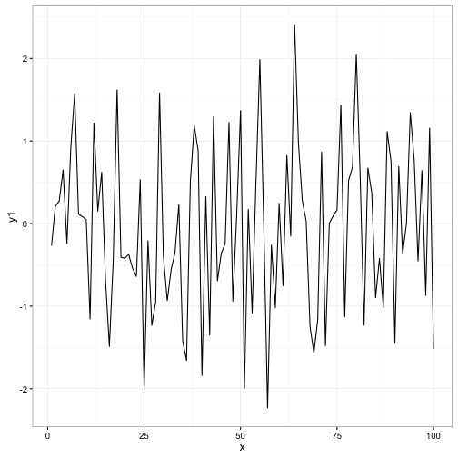
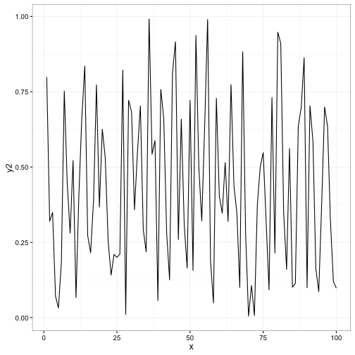

**Contents**

[TOC]

### Main Result

This research suggests that within the first week after the job was claimed,
there is no gain in hurrying the first candidate sent. After a week we can see
how the probability of cancellation starts increasing.

<!-- Loading libraries  -->


_NOTE: in graphs, optimize for being able to **stand alone**. As we aggregate and put things in presentations, we want to not have to recreate and add code to each plot to make it understandable without the entire post around it. When we compare this plot to other people's from other posts, will it be understandable without several paragraphs?_


### Common Mistakes

There are some requirements around how an R Markdown is developed to make the markdown render properly on the site. Here is a list of the ones that often lead to questions:

 - There should be one plot display call in each R block. The add_knowledge script currently gets confused if there are multiple plots in a given block:


```r
  ### My Header (treated as R comment, as it is in a code block)
  library(ggplot2)
  test_data <- data.frame(y1 = rnorm(100), y2 = runif(100), x = 1:100)
  ggplot(test_data, aes(y = y1, x = x)) + geom_line()
```



```r
  ggplot(test_data, aes(y = y2, x = x)) + geom_line()
```



 - Do not put markdown headers in R blocks. The knitr code will interpret the header #'s as R comments. This means that they will either be rendered properly as R comments within the block, or left out entirely if echo=FALSE

### Appendix

Testing a table.

<table>
<caption>This is a random and useless table for testing</caption>
 <thead>
  <tr>
   <th style="text-align:right;"> id </th>
   <th style="text-align:right;"> random </th>
  </tr>
 </thead>
<tbody>
  <tr>
   <td style="text-align:right;"> 1 </td>
   <td style="text-align:right;"> 0.6 </td>
  </tr>
  <tr>
   <td style="text-align:right;"> 2 </td>
   <td style="text-align:right;"> 0.2 </td>
  </tr>
  <tr>
   <td style="text-align:right;"> 3 </td>
   <td style="text-align:right;"> 0.2 </td>
  </tr>
  <tr>
   <td style="text-align:right;"> 4 </td>
   <td style="text-align:right;"> 0.2 </td>
  </tr>
  <tr>
   <td style="text-align:right;"> 5 </td>
   <td style="text-align:right;"> 0.8 </td>
  </tr>
  <tr>
   <td style="text-align:right;"> 6 </td>
   <td style="text-align:right;"> 0.8 </td>
  </tr>
  <tr>
   <td style="text-align:right;"> 7 </td>
   <td style="text-align:right;"> 0.6 </td>
  </tr>
  <tr>
   <td style="text-align:right;"> 8 </td>
   <td style="text-align:right;"> 0.0 </td>
  </tr>
  <tr>
   <td style="text-align:right;"> 9 </td>
   <td style="text-align:right;"> 1.0 </td>
  </tr>
  <tr>
   <td style="text-align:right;"> 10 </td>
   <td style="text-align:right;"> 0.4 </td>
  </tr>
</tbody>
</table>

Here should be a table ^

Put all the stuff here that is not necessary for supporting the points above. Good place for documentation of paths not pursued without distraction.
