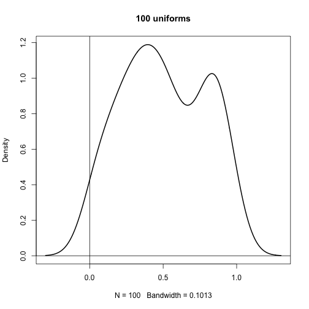
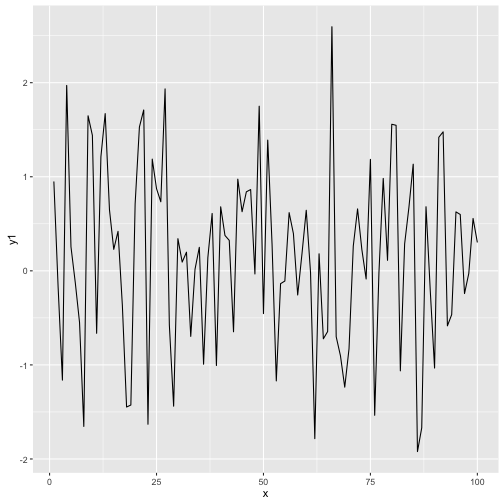

_NOTE: In the TL,DR, optimize for **clarity** and **comprehensiveness**. The goal is to convey the post with the least amount of friction, especially since notebooks require much more scrolling than blog posts. Make the reader get a correct understanding of the post's takeaway, and the points supporting that takeaway without having to strain through paragraphs and tons of prose. Bullet points are great here, but are up to you. Try to avoid academic paper style abstracts._

* Having a specific title will help avoid having someone browse posts and only finding vague, similar sounding titles
* Having an itemized, short, and clear tl,dr will help readers understand your content
* Setting the reader's context with a motivation section makes someone understand how to judge your choices
* Visualizations that can stand alone, via legends, labels, and captions are more understandable and powerful

**Contents**

[TOC]

_NOTE: this will include a table of contents when rendered on the site._


### Motivation

_NOTE: optimize in this section for **context setting**, as specifically as you can. For instance, this post is generally a set of standards for work in the repo. The specific motivation is to have least friction to current workflow while being able to painlessly aggregate it later._

The knowledge repo was created to consolidate research work that is currently scattered in emails, blogposts, and presentations, so that people didn't redo their work. 

### This Section Says Exactly This Takeaway

Here is some example code.


```r
plot(density(runif(100)), lwd=2, main="100 uniforms")
abline(h=0, v=0)
```




_NOTE: in graphs, optimize for being able to **stand alone**. As we aggregate and put things in presentations, we want to not have to recreate and add code to each plot to make it understandable without the entire post around it. When we compare this plot to other people's from other posts, will it be understandable without several paragraphs?_


### Common Mistakes

There are some requirements around how an R Markdown is developed to make the markdown render properly on the site. Here is a list of the ones that often lead to questions:

 - There should be one plot display call in each R block. The add_knowledge script currently gets confused if there are multiple plots in a given block:


```r
  ### My Header (treated as R comment, as it is in a code block)
  library(ggplot2)
  test_data <- data.frame(y1 = rnorm(100), y2 = runif(100), x = 1:100)
  ggplot(test_data, aes(y = y1, x = x)) + geom_line()
```



```r
  ggplot(test_data, aes(y = y2, x = x)) + geom_line()
```


 - Do not put markdown headers in R blocks. The knitr code will interpret the header #'s as R comments. This means that they will either be rendered properly as R comments within the block, or left out entirely if echo=FALSE

### Appendix

Testing a table.

<table>
<caption>This is a random and useless table for testing</caption>
 <thead>
  <tr>
   <th style="text-align:right;"> id </th>
   <th style="text-align:right;"> random </th>
  </tr>
 </thead>
<tbody>
  <tr>
   <td style="text-align:right;"> 1 </td>
   <td style="text-align:right;"> 0.4 </td>
  </tr>
  <tr>
   <td style="text-align:right;"> 2 </td>
   <td style="text-align:right;"> 0.8 </td>
  </tr>
  <tr>
   <td style="text-align:right;"> 3 </td>
   <td style="text-align:right;"> 0.0 </td>
  </tr>
  <tr>
   <td style="text-align:right;"> 4 </td>
   <td style="text-align:right;"> 0.6 </td>
  </tr>
  <tr>
   <td style="text-align:right;"> 5 </td>
   <td style="text-align:right;"> 0.4 </td>
  </tr>
  <tr>
   <td style="text-align:right;"> 6 </td>
   <td style="text-align:right;"> 0.6 </td>
  </tr>
  <tr>
   <td style="text-align:right;"> 7 </td>
   <td style="text-align:right;"> 0.4 </td>
  </tr>
  <tr>
   <td style="text-align:right;"> 8 </td>
   <td style="text-align:right;"> 0.8 </td>
  </tr>
  <tr>
   <td style="text-align:right;"> 9 </td>
   <td style="text-align:right;"> 0.6 </td>
  </tr>
  <tr>
   <td style="text-align:right;"> 10 </td>
   <td style="text-align:right;"> 0.6 </td>
  </tr>
</tbody>
</table>

Here should be a table ^

Put all the stuff here that is not necessary for supporting the points above. Good place for documentation of paths not pursued without distraction.
